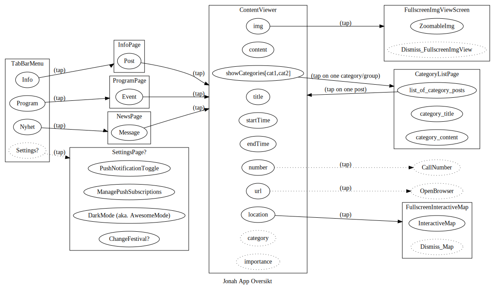

# Jonah

Just another Festival App.

Codename is Jonah because Festival, Festihval=> Jona ble spist av hvalen.
App-en er skrevet i Flutter.
Vi fokuserer på bruker-appen i første omgang og tar sikte på å utvikle en administrasjons-app eller nettside som et eget prosjekt.
Målet er en litt modulær app som kan brukes på flere festivaler.
Back-end er i hovedsak Firebase.

